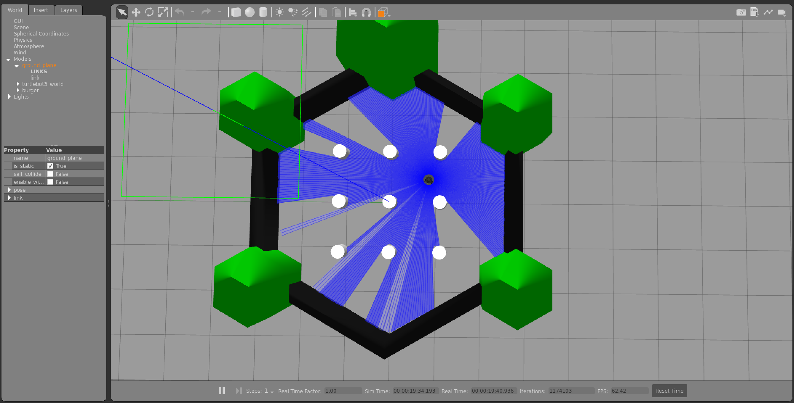

# Autonomous Obstacle-Avoiding Robot Simulation

A beginner-friendly ROS2 Humble project that drives a simulated TurtleBot3 using
LiDAR data. The robot subscribes to `/scan`, decides whether the path ahead is
clear, and publishes velocity commands on `/cmd_vel`.

This repository is structured as a ROS2 workspace starter that can become a
GitHub portfolio project with a demo video, screenshots, and clear engineering
notes.

## Demo



The simulated TurtleBot3 uses LiDAR rays to sense walls and nearby obstacles,
then publishes `/cmd_vel` commands to steer around them.

## What It Demonstrates

| Area | What this project shows |
| --- | --- |
| ROS2 | Nodes, topics, launch files, parameters, package structure |
| Robotics | Reactive control, LiDAR processing, velocity commands |
| Python | Testable decision logic plus a ROS2 integration node |
| Simulation | TurtleBot3, Gazebo, RViz-ready sensor streams |
| Debugging | Configurable thresholds, state logs, repeatable tests |

## Architecture

```text
Gazebo TurtleBot3 LiDAR
        |
        v
     /scan
        |
        v
obstacle_avoidance_node
        |
        v
     /cmd_vel
        |
        v
Robot base controller
```

The core algorithm is intentionally simple:

```text
IF obstacle is close in front:
    rotate toward the side with more open space
ELSE IF obstacle is near:
    slow down and gently steer away
ELSE:
    move forward
```

## Repository Layout

```text
.
|-- images/
|   `-- gazebo-lidar-demo.png
|-- src/
|   `-- obstacle_avoidance/
|       |-- obstacle_avoidance/
|       |   |-- avoidance_logic.py
|       |   `-- obstacle_avoidance_node.py
|       |-- config/
|       |-- launch/
|       |-- worlds/
|       `-- test/
|-- docs/
|-- videos/
`-- README.md
```

## Requirements

Recommended development environment:

- Ubuntu 22.04
- ROS2 Humble
- Gazebo Classic packages for ROS2
- TurtleBot3 simulation packages
- Python 3
- Git

Useful official references:

- [ROS2 Humble installation](https://docs.ros.org/en/humble/Installation.html)
- [TurtleBot3 e-Manual](https://emanual.robotis.com/docs/en/platform/turtlebot3/overview/)
- [Gazebo](https://gazebosim.org/home)

## Setup On Ubuntu 22.04

Install ROS2 Humble first, then install the simulation packages:

```bash
sudo apt update
sudo apt install -y \
  python3-colcon-common-extensions \
  ros-humble-turtlebot3 \
  ros-humble-turtlebot3-gazebo \
  ros-humble-gazebo-ros-pkgs \
  ros-humble-rviz2
```

Build the workspace:

```bash
cd robot_project
source /opt/ros/humble/setup.bash
colcon build --symlink-install
source install/setup.bash
```

If this repository is the workspace root already, run those commands from this
folder.

## Run The Simulation

Launch TurtleBot3 in Gazebo and start the obstacle avoidance node:

```bash
export TURTLEBOT3_MODEL=burger
ros2 launch obstacle_avoidance simulation.launch.py
```

Run only the autonomy node if Gazebo is already running:

```bash
ros2 launch obstacle_avoidance obstacle_avoidance.launch.py
```

In another terminal, inspect the live topics:

```bash
ros2 topic list
ros2 topic echo /scan
ros2 topic echo /cmd_vel
```

## Tune Behavior

Edit [src/obstacle_avoidance/config/avoidance.yaml](src/obstacle_avoidance/config/avoidance.yaml).

Important parameters:

- `obstacle_distance`: distance where the robot stops forward motion and turns.
- `caution_distance`: distance where the robot slows down and starts steering.
- `forward_speed`: normal forward speed in meters per second.
- `turn_speed`: angular speed in radians per second.
- `front_window_degrees`: width of the LiDAR sector treated as "front."

## Run Tests

The decision logic is pure Python and can be tested without ROS2:

```bash
python -m pytest src/obstacle_avoidance/test
```

Inside a ROS2 workspace, you can also run:

```bash
colcon test --packages-select obstacle_avoidance
colcon test-result --verbose
```

## RViz

Start RViz after the simulation is running:

```bash
rviz2
```

Add displays for:

- `LaserScan` on `/scan`
- `RobotModel`
- `TF`
- `Odometry`, if available from the simulation

## Demo Ideas

For a portfolio README, add:

- A GIF of the robot avoiding obstacles in Gazebo.
- A screenshot of RViz showing LiDAR points.
- A terminal screenshot showing `/scan` and `/cmd_vel`.
- A short explanation of what you tuned and why.

See [docs/demo_checklist.md](docs/demo_checklist.md) for a recording checklist.
